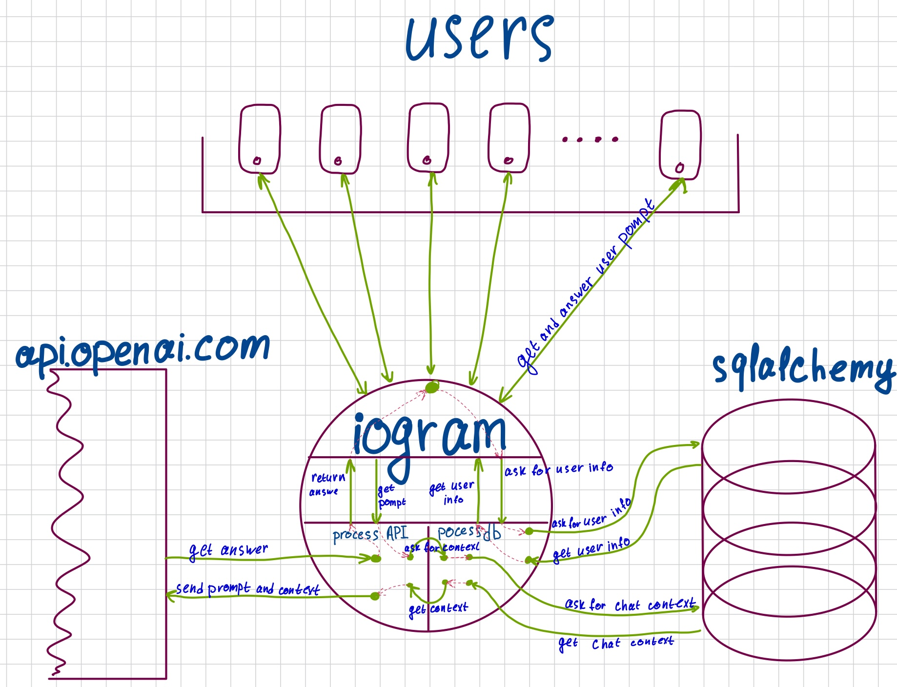

# Pomogator
[Наш репозиторий](https://github.com/AlexKrachun/pomogator)

## Функционал:
Телеграм бот с функциями
- Выбор нейросети - среди моделей openai
- Отображение профиля - количество оставшихся запросов
- Создать новый чат
- Получить памятку об устройстве бота
- Отправить текстовый промпт
- Получить текстовый ответ на промпт

## UI:
Классический телеграм бот с нейросетями like @chatsgpts_bot

## Структура проекта:

### База данных
2 таблицы на sqlalchemy

Первая *Users* со столбцами:
- _user_id_ - идентификатор пользователей,
- _username_ - ник-нейм в тг
- список ключей чатов _chat_ids_
  
  

Вторая  *Chats*:
- chat_id - ключ чата
- _user_id_ - ключ пользователя 
- _chat_body_ - список всех запросов, ответов, а также роль gpt в этом чате
- _last_updated_: время последнего обновления контекста

### Архитектура, внутренняя начинка

## Роли
Крамин Карим - @ktkramin
- реализация базы данных
- разработка основной логики бота - обработка команд.

Карачун Александр - @alex_karachun
- создание функций для взаимодействия с API OpenAI.
- разработка основной логики бота, обработка сообщений.

Общее
- Работа с асинхронными функциями и оптимизация производительности.
- Настройка и управление хостингом на VPS.
- Конфигурация системы логирования и мониторинга.
